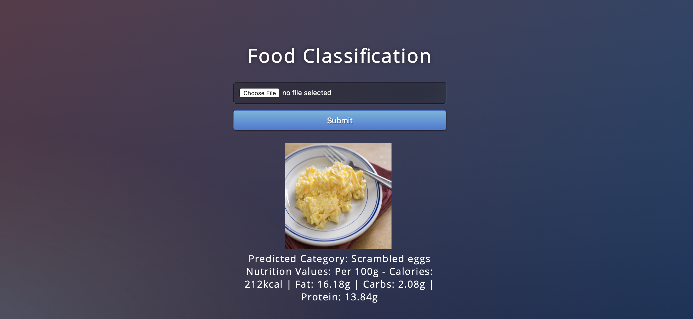

# Food Classification & Nutrition Information

## Business Problem:
The objective of this project is to solve following business problems:
1. **Food classification**: To classify the food on the basis of the provided image.
2. **Nutrition Information**: Provide the nutrition information of the classified item.
3. **Insulin Units**: Provide number of insulin units required after taking the food.

## Data:
Data can be downloaded from [here](https://drive.google.com/drive/folders/1ZWuq5x9qPbzMBXPTPaKl3P9aSNLL3q0d). Data contains 58,962 images in 157 categories. Due to infrastructure constrains, only 7 classes were used for the project: Pasta with meat sauce, Chicken Breast, Omlette with Potatoes, Roasted Pork, Scrambled Eggs, Chicken Wings and Chicken Curry.

## Approach:
CNN and SVM models were used to train the model. SVM was used in the app and deployed on local server due to simplicity of SVM model and issue of multi-threading in flask app when using neural networks. 

## Files:
* CNN.ipynb contain the CNN training of the model
* SVM.ipynb contains the SVM training of the model
* Prediction.ipynb contains the prediction function for both CNN and SVM
* app.py contains the flask app

  
**To run the app, simply open the terminal in this folder and type 'python3 app.py'. Then copy the local server link from the terminal and paste it in the brower to access the app.**